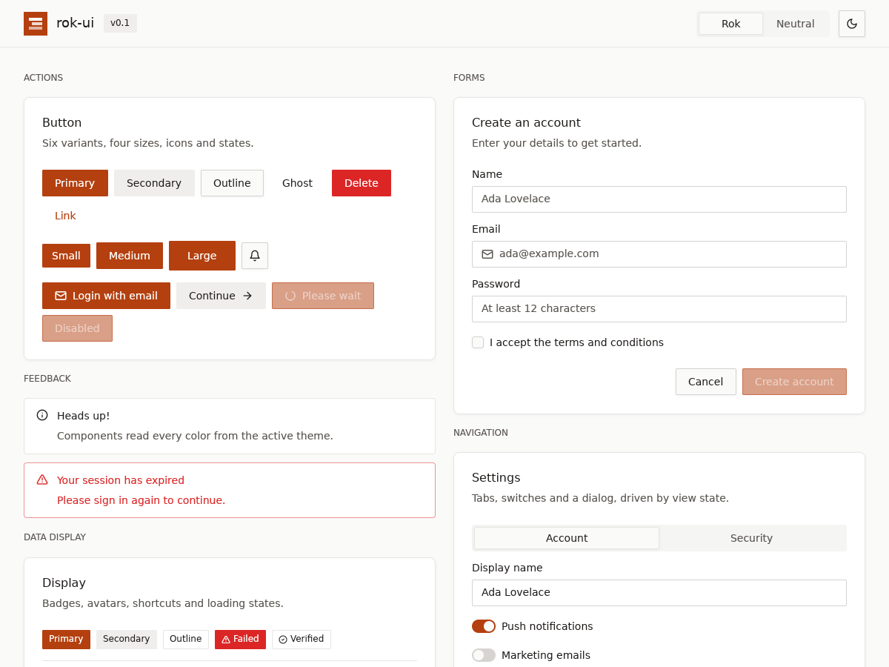
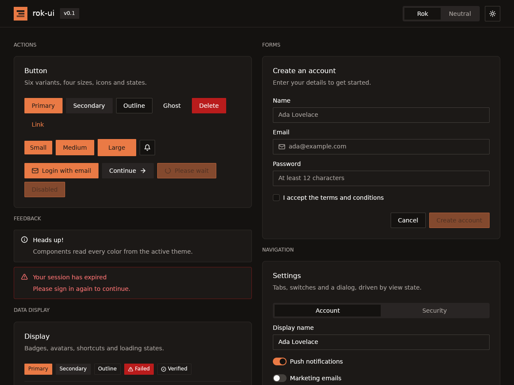
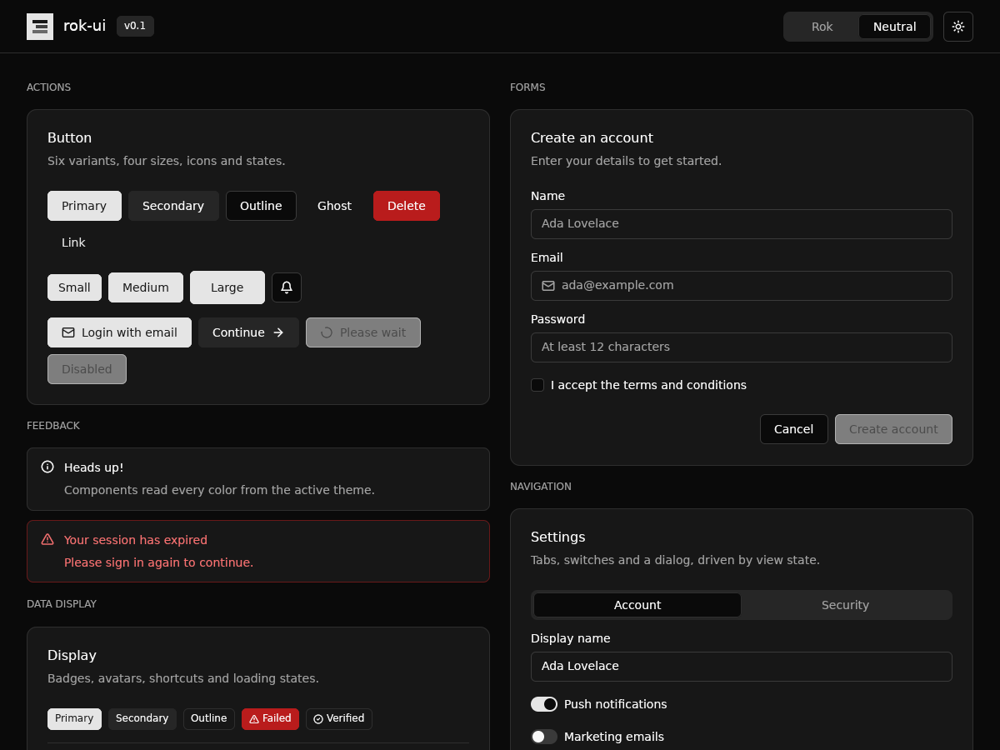
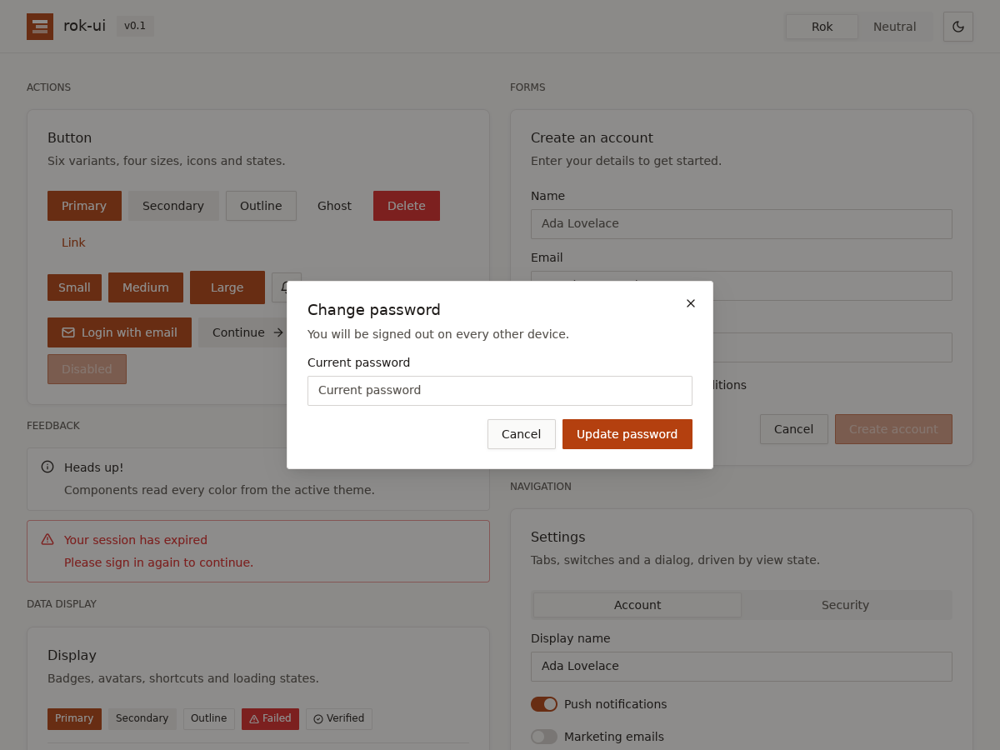

# rok-ui

A [shadcn/ui](https://ui.shadcn.com)-style component system for desktop apps built with
[GPUI](https://gpui.rs), the GPU-accelerated UI framework from the Zed team, with a React-like
developer experience.

- **shadcn/ui's components and tokens.** Button, Card, Input, Dialog, Tabs, and more, styled from
  the same design tokens (`background`, `primary`, `muted-foreground`, `ring`, …).
- **React-like components.** Write a function with `#[component]` and get a builder API. Props
  become arguments or builder methods, `#[children]` gives you `.child(..)`, and `use_state`
  works like `useState`.
- **Overridable styles.** Every visual component implements GPUI's `Styled`, so `.w_full().mt_4()`
  overrides its defaults the way `className` does.
- **Themes.** Light and dark modes, two presets (Rok and Neutral), and every text/surface pair is
  tested to reach at least 4.5:1 contrast.
- **Keyboard support.** Tab and Shift-Tab move focus, Enter and Space activate buttons, and Escape
  closes dialogs. Text fields support IME composition, selection and the clipboard.

| Rok, light | Rok, dark |
|---|---|
|  |  |
| **Neutral, dark** | **Dialog** |
|  |  |

These are real renders of `cargo run --example gallery` on Linux.

## Install

```toml
[dependencies]
rok-ui = "0.1"
gpui = "0.2.2"   # rok-ui re-exports it as rok_ui::gpui; keep the versions in step
```

rok-ui 0.1 targets **gpui 0.2.2** from crates.io and Rust 1.85 or newer.

On Linux, GPUI needs the X11/Wayland development packages. On Debian/Ubuntu:

```sh
sudo apt install libxkbcommon-dev libxkbcommon-x11-dev libwayland-dev libvulkan1
```

## Quick start

```rust
use rok_ui::prelude::*;

struct HelloWindow;

impl Render for HelloWindow {
    fn render(&mut self, _window: &mut Window, _cx: &mut Context<Self>) -> impl IntoElement {
        AppRoot::new()                       // applies the theme: background, text, font
            .items_center()
            .justify_center()
            .child(Button::new("hello").icon(IconName::Plus).label("Hello, rok-ui"))
    }
}

fn main() {
    Application::new()
        .with_assets(rok_ui::Assets)         // serves the built-in icons
        .run(|cx: &mut App| {
            rok_ui::init(cx);                // installs the theme and key bindings
            cx.open_window(WindowOptions::default(), |_, cx| cx.new(|_| HelloWindow))
                .unwrap();
        });
}
```

The examples:

```sh
cargo run --example counter                       # a function component with a hook
cargo run --example gallery                       # every component, with theme switching
cargo run --example gallery -- --dark --preset neutral
```

## Coming from React and shadcn/ui

| React / shadcn/ui | rok-ui |
|---|---|
| `function Card(props) { … }` | `#[component] fn Card(…) -> impl IntoElement { … }` |
| `<Button variant="outline" size="sm">Save</Button>` | `Button::new("save").outline().small().label("Save")` |
| `props.children` | `#[children] children: Vec<AnyElement>` |
| `className="w-full mt-4"` | `.w_full().mt_4()` |
| `onClick={() => …}` | `.on_click(\|event, window, cx\| …)` |
| `const [count, setCount] = useState(0)` | `let count = use_state(window, cx, \|\| 0)` |
| `setCount(5)` / `setCount(c => c + 1)` | `count.set(5, cx)` / `count.update(cx, \|c\| *c += 1)` |
| `useRef` for an input | `use_input_state("email", window, cx, \|s\| s)` |
| `var(--primary)` | `cx.theme().colors.primary` |
| `<ThemeProvider>` | `AppRoot::new()` plus `Theme::set_global(..)` |

### Writing a component

```rust
use rok_ui::prelude::*;

/// A counter, written the way you would in React.
#[component]
pub fn Counter(
    /// Required props become arguments of `Counter::new(..)`.
    title: SharedString,
    /// Optional props start at `Default::default()` and get a builder method.
    #[prop(optional)] step: Option<i32>,
    /// `EventHandler<E>` props accept a closure directly.
    #[prop(optional)] on_change: Option<EventHandler<i32>>,
    /// `window` and `cx` are passed through; leave them out if you do not need them.
    window: &mut Window,
    cx: &mut App,
) -> impl IntoElement {
    let count = use_state(window, cx, || 0);
    let step = step.unwrap_or(1);

    Card::new()
        .child(CardHeader::new().child(CardTitle::new(title)))
        .child(CardContent::new().child(count.get(cx).to_string()))
        .child(CardFooter::new().child(
            Button::new("increment").label("Increment").on_click(move |_, window, cx| {
                count.update(cx, |value| *value += step);
                if let Some(on_change) = &on_change {
                    on_change(&count.get(cx), window, cx);
                }
            }),
        ))
}

// Usage
Counter::new("Clicks").step(5).on_change(|value, _, _| println!("{value}"));
```

Parameter rules for `#[component]`:

- `window` and `cx` are the GPUI window and app context.
- Plain parameters are required props. `new(..)` takes them as `impl Into<T>`.
- `#[prop(optional)]` parameters default to `Default::default()` and get a builder method with
  the same name. For `Option<T>`, the method takes `impl Into<T>`.
- `EventHandler<E>` props, optional or not, take `Fn(&E, &mut Window, &mut App)` closures.
- One `#[children]` parameter of type `Vec<AnyElement>` makes the component a `ParentElement`.
- One `#[style]` parameter of type `StyleRefinement` makes the component `Styled`. Apply it last
  in the body with `.apply_style_overrides(&style_overrides)`.

### Hooks

`use_state` builds on GPUI's own `Window::use_state`. State lives as long as the component
keeps rendering at the same position, and updating it re-renders the owning view. Follow
React's rules of hooks: call hooks unconditionally and in the same order every render. Inside
loops, use `use_keyed_state(key, …)` with a stable key per item.

Long-lived or shared state still belongs in a GPUI view (`Entity<T>` with `cx.notify()`). The
gallery's settings card shows this pattern, with `cx.listener(..)` as the change handler.

## Components

| Component | Notes |
|---|---|
| `AppRoot` | Window root. Applies theme colors and font, and wires Tab / Shift-Tab. |
| `Button` | Variants: `Primary`, `Secondary`, `Outline`, `Ghost`, `Destructive`, `Link`. Sizes: `Small`, `Medium`, `Large`, `Icon`. Also `.icon()`, `.icon_position()`, `.loading()`, `.disabled()`, `.tooltip()`. |
| `Badge` | `Primary`, `Secondary`, `Destructive` and `Outline` variants, with an optional icon. |
| `Card`, `CardHeader`, `CardTitle`, `CardDescription`, `CardContent`, `CardFooter` | Composed exactly like shadcn/ui. Built with `#[component]`. |
| `Input` + `InputState` | Single-line text field: placeholder, masked text, leading icon, invalid state. Emits `InputEvent::Changed` and `InputEvent::Submitted`. |
| `Label` | Form label, with a disabled state. |
| `Checkbox` | Controlled: `.checked(bool)` and `.on_change(\|checked, …\|)`. Optional label. |
| `Switch` | Controlled toggle with an optional label. |
| `Tabs` | Controlled segmented tab list: `.selected_index()` and `.on_change()`. You render the panel. |
| `Dialog` | Modal with backdrop, title, description, body and footer. Closes on Escape, on a backdrop click or with the close button. |
| `Alert` | `Default` and `Destructive` variants, with an icon, title and description. |
| `Tooltip` | `Tooltip::text("…")` for any `.tooltip(..)`. Buttons take `.tooltip("…")`. |
| `Avatar` | Image with an initials fallback. |
| `Progress` | Percentage bar. |
| `Skeleton` | Pulsing placeholder. |
| `Spinner` | Rotating loader. |
| `Separator` | Horizontal or vertical 1px rule. |
| `KeyboardShortcut` | shadcn/ui's `<Kbd>` key cap. |
| `Icon` | 18 built-in stroke icons (`IconName::ALL`). |

Controlled components never own their value. You pass `checked`, `selected_index` or `open` in,
and read changes back through `on_change` / `on_close`, as with controlled React inputs.

## Theming

Tokens mirror shadcn/ui's CSS variables:

| shadcn/ui | rok-ui (`cx.theme().colors.*`) |
|---|---|
| `--background` / `--foreground` | `background` / `foreground` |
| `--card`, `--popover` (+ `-foreground`) | `card`, `popover` (+ `_foreground`) |
| `--primary`, `--secondary`, `--muted`, `--accent` (+ `-foreground`) | same names in snake_case |
| `--destructive` (+ `-foreground`) | `destructive`, `destructive_foreground`, plus `destructive_text` for error text on surfaces |
| `--border`, `--input`, `--ring` | `border`, `input`, `ring` |
| `--radius` | `theme.radius`, with `radius_small()`, `radius_medium()`, `radius_large()`, `radius_extra_large()` |

```rust
Theme::toggle_mode(cx);                                         // light ↔ dark
Theme::change_preset(ThemePreset::Neutral, cx);                 // switch palette
Theme::sync_with_system_appearance(window, cx);                 // follow the OS

// A custom brand: start from a preset and override tokens.
let mut theme = Theme::from_preset(ThemePreset::Neutral, ThemeMode::Light);
theme.colors.primary = gpui::rgb(0x2F5D50).into();
theme.radius = px(10.);
Theme::set_global(theme, cx);
```

**Rok** (the default) uses warm stone neutrals, an ember accent (`#B4400F` light, `#EA7A45` dark)
and 4px corners. **Neutral** is shadcn/ui's neutral palette with 8px corners. Two of its values
are darkened (muted text `#666666`, destructive `#DC2626`) so every pair passes 4.5:1. The
`every_text_pair_reaches_four_point_five_to_one` test enforces this for every preset and mode.

If your app has its own assets, layer rok-ui's icons over them:

```rust
Application::new().with_assets(rok_ui::Assets::with_fallback(MyAssets))
```

## Project layout

```
rok-ui/
├── Cargo.toml              workspace + the rok-ui crate
├── macros/                 rok-ui-macros: the #[component] attribute
├── assets/icons/           built-in SVG icons (embedded at compile time)
├── src/
│   ├── lib.rs              init(), re-exports
│   ├── prelude.rs          use rok_ui::prelude::*
│   ├── theme/              Theme, ThemeColors, presets, ActiveTheme
│   ├── hooks.rs            use_state, use_keyed_state, State, EventHandler
│   ├── styles.rs           ApplyStyleOverrides, ComponentSize
│   ├── icon.rs             Icon, IconName, Assets
│   └── components/         one file per component
├── examples/               counter.rs, gallery.rs
├── tests/components.rs     macro API, hooks, full render under every theme
└── docs/screenshots/
```

## Development

```sh
cargo fmt --all --check
cargo clippy --all-targets -- -D warnings
cargo test
```

To publish, release the macro crate first, then the main crate:

```sh
cargo publish -p rok-ui-macros
cargo publish -p rok-ui
```

## Known limitations (0.1)

- Focus rings show after mouse clicks as well as keyboard focus. GPUI 0.2.2 has no
  `:focus-visible` equivalent.
- Dialogs move focus into the panel, but they do not trap Tab yet. Focus does not jump to the
  first field automatically.
- `Input` is single-line. There are no textarea, select, dropdown menu, popover or toast
  components yet.
- Font weights depend on the system UI font. Some Linux fonts have no medium or semibold weight,
  so those render as regular.

## License

MIT
